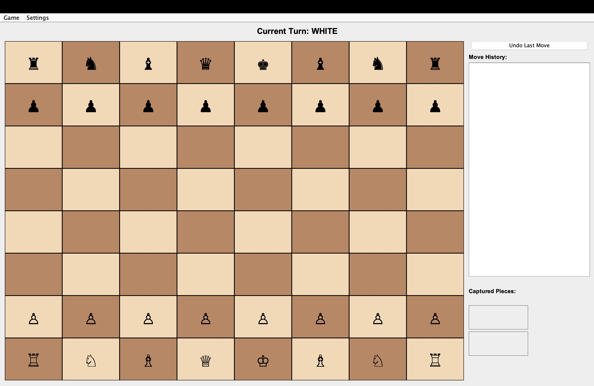
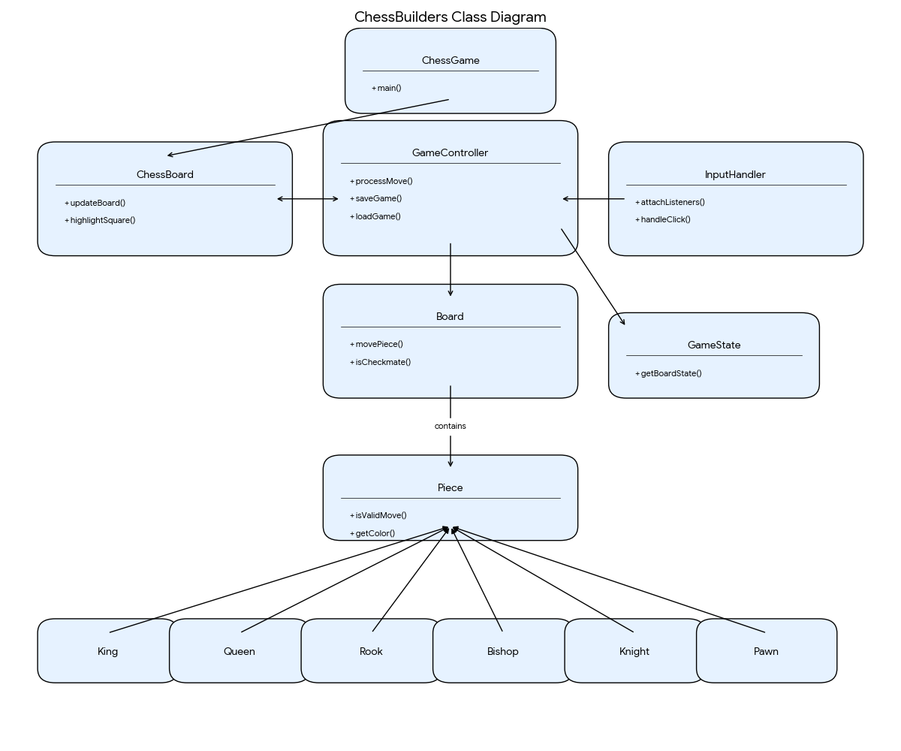

# GUI Chess Game Project

## Team Information

* **Team Name:** ChessBuilders
* **Team Members:**
    * Andre Mercado
    * Zachary Terry
    * Muhammad Hashir
* **Semester:** Fall 2025
* **Course Number and Section:** CS 3354.R01

## Project Overview

This project is a fully functional Chess application built in Java. It combines backend logic with a graphical user interface (GUI) using Swing. The project is designed based of separate game logic from the visual interface.

**System Architecture:**

* **The Logic (Model)**
    * `ChessBuilders.board.Board`: Maintains the 8x8 grid, validates move paths, simulates moves to prevent self-check, and detects Checkmate.
    * `ChessBuilders.pieces.*`: Contains logic for individual pieces (e.g., `King.java`, `Knight.java`) defining specific movement rules (e.g., L-shapes for Knights).
* **The Interface (View)**
    * `ChessBuilders.gui.ChessGame`: The main window frame containing the Menu Bar, History sidebar, and Captured Pieces panels.
    * `ChessBuilders.gui.ChessBoard`: The visual 64-square grid. Handles drawing buttons, themes (Green/White/Wood), and piece icons. It is strictly visual and does not know chess rules.
* **The Controls**
    * `ChessBuilders.gui.GameController`: It initializes the backend, validates moves, updates the backend, records history ("e2 -> e4"), and triggers UI repaints. It also handles Save/Load functionality.
    * `ChessBuilders.gui.InputHandler`: Handles mouse clicks and drag-and-drop events, translating pixel clicks into grid coordinates for the controller.

## Preview

### GUI Preview


### Class Diagram


## How to Run the Project

### Prerequisites
* Java Development Kit (JDK) 8 or higher.

### Option 1: Visual Studio Code (Recommended)
1.  Ensure you have the **"Extension Pack for Java"** installed.
2.  Go to **File > Open Folder...** and select the **parent folder** containing the `ChessBuilders` directory.
3.  Navigate to `ChessBuilders/Main.java`.
4.  Click **Run Java**.

### Option 2: Command Line (Windows)
Open Command Prompt (cmd) or PowerShell and navigate to the folder containing the `ChessBuilders` directory.

1.  **Compile:**
    ```cmd
    javac ChessBuilders\Main.java
    ```
2.  **Run:**
    ```cmd
    java ChessBuilders.Main
    ```

### Option 3: Command Line (macOS/Linux)
Open your terminal and navigate to the folder containing the `ChessBuilders` directory.

1.  **Compile:**
    ```bash
    javac ChessBuilders/Main.java
    ```
2.  **Run:**
    ```bash
    java ChessBuilders.Main
    ```

## Features Checklist

- [x] GUI with an 8x8 Chessboard
- [x] Piece Movement with Mouse Interaction (Click-to-Move & Drag-and-Drop)
- [x] Move Validation Based on Chess Rules
- [x] Capture Mechanism
- [x] Check and Checkmate Detection
- [x] Turn-Based Play for Two Players
- [x] Game End Notification on Checkmate
- [x] **Extra Feature:** Pawn Promotion to Queen
- [x] **Extra Feature:** Undo Move Functionality
- [x] **Extra Feature:** Save/Load Game State (.save files)
- [x] **Extra Feature:** Visual Themes (Classic, Modern, Wood, Ocean)
- [x] **Extra Feature:** Move History Log


